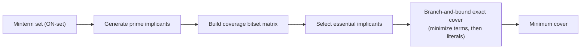
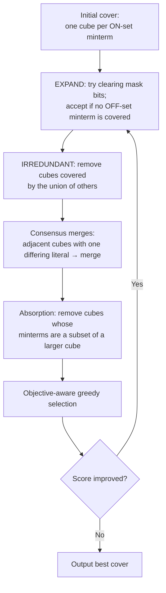
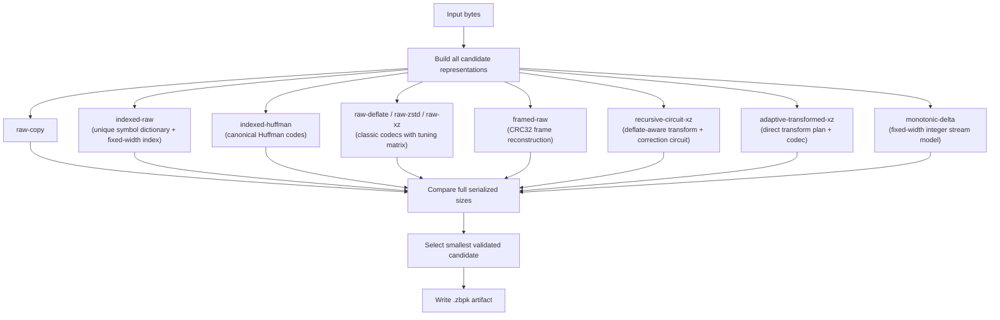
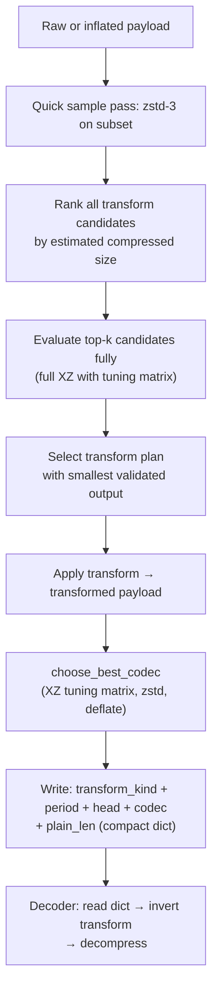
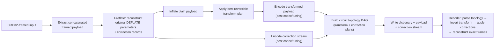
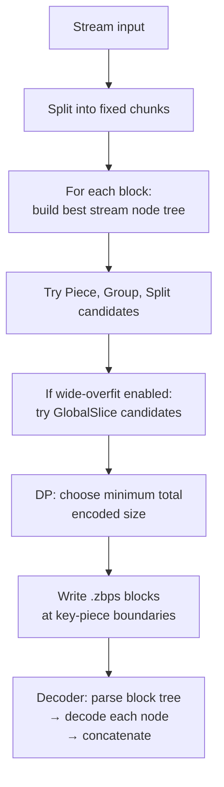

25 May 2026 - Version: 1.0

# zBitCompressor: Structural Boolean Compression via Generalized Karnaugh Maps and Adaptive Transform Circuits

**Riccardo Cecchini** (*rcecchini.ds@gmail.com*)

---

## Abstract

I present **zBitCompressor**, an experimental compression system that treats input data not merely as a linear byte sequence but simultaneously as a high-dimensional Boolean landscape. Inspired by the Karnaugh-map abstraction from digital logic design, the compressor searches for regions of this landscape that can be described more compactly as simplified logic circuits than as raw bytes. The system integrates exact Boolean minimization (Quine-McCluskey style, bounded at 16 inputs), Espresso-inspired iterative heuristic cover refinement, SAT-assisted local pruning, and a canonical circuit DAG with structural sharing. For real-file compression, a multi-candidate adaptive packer evaluates dozens of reversible representations—including raw codecs, symbolic dictionaries, framed-payload models, reversible-transform circuits, and monotonic-stream encoders—and selects the smallest validated candidate. A key finding is that reversible-transform circuits can discover periodic structure inside neural network weight tensors, achieving **15.96% space savings** on a PyTorch model file where classical codecs such as XZ/LZMA2 reach only 7–9%. The architecture also supports a streaming mode with restartable key-piece blocks and multi-level grouping. Exact byte-for-byte roundtrip validation is mandatory for every selected representation. Rust implementation source code is available at [https://github.com/Geckos-Ink/zBitCompressor.rs](https://github.com/Geckos-Ink/zBitCompressor.rs).

---

## 1. Introduction

The dominant paradigm in practical data compression is to find recurring patterns in a byte stream and encode back-references to them. Lempel-Ziv family methods [LZ77, LZ78, LZMA] search for repeated substrings; arithmetic and Huffman coders exploit symbol frequency distributions; context-mixing engines model conditional probabilities. These approaches are extraordinarily effective on text, source code, log files, and many structured binary formats. However, they treat the input as a one-dimensional sequence and cannot directly exploit deeper structural regularities: repeated logical generation rules, periodic byte-stride patterns, bit-plane correlations, or the fact that two distant byte regions might be produced by the same latent function up to a small residual.

Neural network model files expose this limitation clearly. A typical `.pth` or `.safetensors` file contains millions of floating-point weights packed into tensors. The weights are not random, but their local byte-level entropy is high enough that classical codecs offer only marginal compression—7–9% savings with LZMA2 at maximum effort. The underlying structure is not a repeated substring; it is a periodic generation rule operating at the stride of the tensor's element width and channel layout.

**zBitCompressor** approaches compression from a different angle. Borrowing from Boolean logic synthesis, it models input data as a Boolean function: a map from input assignments (bit positions, contexts, symbolic indices, or transform-space coordinates) to output bits. Regions where this function is constant or follows a predictable rule correspond to K-map "groups"—cubes that can be represented by fewer literals than the raw bit count. When a compact circuit description of such a region, together with all necessary metadata and residual corrections, is smaller than the raw bytes, the circuit is stored instead.

The contribution of this paper is threefold:

1. A formalization of the Boolean-landscape view of binary data and its relationship to classical Karnaugh-map logic minimization.
2. A practical multi-layer compression architecture combining exact minimization, heuristic cover refinement, SAT-assisted pruning, reversible-transform circuits, and adaptive multi-candidate packing.
3. Experimental evidence that this approach can achieve significant gains on neural network weight files where classical codecs saturate, specifically **15.96% savings** on a 99.2 MB PyTorch ViT-S model—roughly double the savings achievable with raw XZ/LZMA2.

The remainder of the paper is organized as follows. Section 2 reviews related work. Section 3 formalizes the Boolean-landscape model. Section 4 describes the Boolean minimization layer. Section 5 presents the adaptive packing architecture. Section 6 details the reversible-transform circuit path. Section 7 covers the streaming mode. Section 8 reports experimental results. Section 9 discusses limitations, open problems, and future directions.

---

## 2. Background and Related Work

### 2.1 Classical Lossless Compression

Lempel-Ziv compression [Ziv & Lempel 1977, 1978] encodes a stream by replacing repeated substrings with offset-length back-references into a sliding window or dictionary. Derivatives—LZW, LZ4, Zstandard, DEFLATE/zlib—form the backbone of virtually all general-purpose compression software. LZMA/LZMA2 (used in XZ) augments LZ77 with range-coded entropy and large dictionary support, yielding state-of-the-art compression on text and structured binary data. Arithmetic coding [Rissanen & Langdon 1979] achieves near-entropy coding when a good probability model is available. Context mixing [Mahoney 2005] maintains an ensemble of models.

None of these approaches have a direct concept of a logical generation rule for a byte range. They can discover that a region repeats but not that two non-overlapping regions are produced by the same parameterized transform.

### 2.2 Boolean Logic Minimization

The Karnaugh map [Karnaugh 1953] is a visual method for simplifying Boolean functions over a small number of variables by grouping adjacent minterms into implicants. The Quine-McCluskey algorithm [Quine 1952, McCluskey 1956] makes this process systematic and machine-executable: it exhaustively generates all prime implicants via iterative adjacency merging, then solves a minimum set-cover problem to find the smallest Boolean expression. While exact, Q-M is exponential in the number of inputs and impractical beyond 15–20 variables.

Espresso [Brayton et al. 1984] replaces exhaustive prime generation with an iterative cover-improvement strategy (EXPAND → IRREDUNDANT → REDUCE), achieving near-optimal two-level minimization in practical time. Modern synthesis tools extend this with graph-based AIG/XAG rewriting, SAT-based local exactness, and technology-aware cost models [Mishchenko et al. 2006].

zBitCompressor applies these ideas in an unconventional direction: rather than minimizing circuit area, it minimizes the serialized byte cost of a logical description of data.

### 2.3 Transform-Based Compression

Reversible data transforms have a long history in image and signal compression. PNG applies per-scanline predictors (Sub, Up, Average, Paeth) before DEFLATE to decorrelate adjacent pixel values. The LZMA delta filter applies byte-level differencing before LZMA2. BWT (Burrows-Wheeler Transform) reorders bytes to concentrate identical symbols. Preflate [Kientzle 2014] can reconstruct exact DEFLATE bitstreams from their inflated payload plus a small correction record, enabling recompression.

zBitCompressor systematizes these ideas into a framework where many reversible-transform families compete and the best-fitting plan is selected per input. Critically, this search is coupled with cost-gated validation: a transform plan is accepted only when the compressed transformed payload plus all metadata and correction costs beat the current best competing codec.

### 2.4 Model Compression and Quantization

Reducing neural network model file sizes is normally pursued through weight quantization [Hubara et al. 2016], pruning [Han et al. 2015], or distillation [Hinton et al. 2015]—all lossy. Lossless compression of raw model files receives less attention, partly because classical codecs offer limited gain. My work is orthogonal to quantization: it targets lossless compression of whatever byte representation the model uses, including already-quantized weights.

---

## 3. Data as a Boolean Landscape

### 3.1 The K-Map Analogy

A Karnaugh map assigns each combination of $n$ binary input variables to one cell of a $2^n$-cell grid ordered by Gray code. Cells where the output function equals 1 form the *ON-set*; cells where it equals 0 form the *OFF-set*; cells whose value is irrelevant form the *don't-care set* (DC-set). Maximal rectangular groups of ON-set cells represent implicants: product terms that can be described with fewer literals than the constituent minterms. The description cost of a K-map group is $O(\text{literals})$, which is sublinear in the number of minterms it covers.

zBitCompressor generalizes this idea beyond the small visual grid:

| K-map concept    | zBit generalization                                                            |
| ---------------- | ------------------------------------------------------------------------------ |
| Cell             | A byte, a bit, a symbol, a chunk, a transformed position, or a truth-table row |
| ON-set minterm   | A position/assignment where a modeled output bit is `1`                        |
| OFF-set          | A position/assignment where the output must be `0`                             |
| Don't-care       | A position whose value can be chosen freely or corrected separately            |
| Cube / implicant | A rectangular region over many dimensions                                      |
| Circuit          | A compact executable description of one or more such regions                   |

The key compression criterion is:

$$\text{compress}(R) = \text{true} \iff \text{size}(\text{model}(R)) + \text{size}(\text{metadata}) + \text{size}(\text{corrections}(R)) < \text{size}(R)$$

The system never forces a circuit description; it is always one candidate among many.

### 3.2 Implicant Representation

The primitive unit of the Boolean layer is a *cube*:

$$\text{Implicant} = \{(\texttt{value}: u32, \; \texttt{mask}: u32)\}$$

A mask bit equal to 1 means the corresponding input bit is fixed and contributes one literal. A mask bit equal to 0 means the input bit is free: the cube covers both values along that dimension, exactly as a K-map group spans two adjacent cells by eliminating the variable that distinguishes them. For $n$ input variables, a cube with $k$ fixed bits covers $2^{n-k}$ minterms while requiring only $k$ literals in the circuit.

*Figure 1. Exact two-level minimization flow.*

### 3.3 From Boolean Table to Circuit DAG

Once a minimum cover is found, it is compiled into a canonical directed acyclic graph (DAG) of logic nodes:

* **Pin**: an input variable.
* **Not**: bitwise inversion.
* **And**: product term over a set of literals (one per cube).
* **Or**: sum over all product terms.
* **Xor**: parity computation.

Nodes are *interned*: structurally equal subexpressions map to the same node ID. Commutative inputs are sorted; duplicate `And`/`Or` children are deduplicated; `Not(Not(x))` collapses to `x`; constant propagation eliminates `x & false` and `x | true`. This structural canonicalization is essential: it prevents storing duplicated logic and enables future cross-region sharing.

The circuit can be serialized to a compact binary format, evaluated for any input assignment, and validated against the original truth table. Validation is mandatory: a circuit description is rejected unless it reconstructs the expected output exactly for every input.

---

## 4. Boolean Minimization Layer

### 4.1 Exact Minimization (Bounded)

The exact minimizer follows the Quine-McCluskey paradigm:

1. Merge the ON-set and DC-set into a combined term list.
2. Repeatedly combine pairs of terms whose masks are equal and whose values differ in exactly one bit position—the direct analog of grouping two adjacent K-map cells. The merged term clears the differing bit from both value and mask, representing a cube one dimension larger.
3. Collect all terms never absorbed into a larger cube as prime implicants.
4. Build a coverage matrix: rows are prime implicants, columns are ON-set minterms, entry is 1 if the implicant covers the minterm.
5. Select essential implicants (those uniquely covering at least one minterm).
6. Solve the residual coverage problem by branch-and-bound depth-first search, pruning branches whose partial cost already exceeds the current best.

Exact minimization is intentionally **bounded** at 16 input variables. Beyond this threshold, the number of prime implicants can grow exponentially and the set-cover problem becomes intractable. For larger problems, the system falls back to heuristic methods.

### 4.2 Heuristic Cover Refinement (Espresso-Style)

For inputs beyond the exact bound, or as an additional optimization pass, the system employs an iterative cover-improvement strategy inspired by Espresso:

*Figure 2. Espresso-style heuristic cover-refinement loop.*

Each expansion step is guarded by an explicit check that the enlarged cube covers only ON-set and DC-set assignments—OFF-set coverage is never permitted.

### 4.3 SAT-Assisted Local Pruning

A lightweight DPLL-based SAT solver performs bounded redundancy tests. For each cube $c$ in a candidate cover $C$, the prover asks: *does there exist an assignment covered by $c$ but not by any other cube in $C$, and belonging to the ON-set (not purely a don't-care)?* If the formula is unsatisfiable, $c$ is redundant and can be removed without violating coverage.

The SAT oracle is invoked only for inputs at or below a configurable limit (default: 12 variables), keeping its cost bounded. This matches the theoretical recommendation that SAT is most valuable as a selective local exactness engine inside a larger heuristic flow [Sapra et al. 2003].

### 4.4 Technology-Aware Objectives

The compressor supports multiple optimization targets beyond raw literal count:

| Objective      | Primary cost metric             |
| -------------- | ------------------------------- |
| `LiteralCount` | Total literals across all cubes |
| `AsicArea`     | Proxy: AND2 gates + inversions  |
| `AsicDelay`    | Proxy: critical path depth      |
| `FpgaLut4`     | Estimated 4-input LUT count     |
| `FpgaLut6`     | Estimated 6-input LUT count     |

The final cover minimizing the selected objective is reported alongside the associated implicant count, literal count, estimated gate count, depth, and LUT count.

---

## 5. Adaptive Representation Selection

### 5.1 Multi-Candidate Architecture

Real-file compression in zBitCompressor does not commit to a single algorithm. For every input (or input range, in streaming mode), a set of candidate representations is built and their full serialized sizes are compared. The smallest candidate that passes exact roundtrip validation is selected.

*Figure 3. Adaptive multi-candidate packing architecture.*

The selection rule has one invariant: **the output is never larger than the raw input**. Raw-copy is always a valid fallback, so any input that cannot be compressed is stored verbatim with minimal overhead.

### 5.2 Candidate Methods

* **raw-copy**: Verbatim storage. Baseline fallback.
* **indexed-raw**: Scans the input for unique symbols, assigns compact IDs, and writes a bit-packed symbol-index stream. Profitable when the alphabet is small relative to the input length.
* **indexed-huffman**: Canonical Huffman coding over the symbol distribution. The codebook is stored as `(symbol, code_length)` pairs; exact bit codes are reconstructed at decode time without storing the tree.
* **indexed-circuit**: Each unique symbol is represented as a serialized Boolean circuit over a small truth table. Currently gated to symbol widths above 8 bits, since a raw byte dictionary is denser than per-byte circuit descriptors; the foundation exists for wider symbols and future atlas entries.
* **raw-deflate / raw-zstd / raw-xz**: Standard general-purpose codecs. XZ/LZMA2 is evaluated with a multi-parameter tuning matrix (dictionary size, literal context bits, position bits, nice length, match finder, mode) and a cheap XZ-3 pre-ranking pass that eliminates costly full-matrix evaluation when a clear winner exists.
* **framed-raw**: Detects runs of CRC32-framed byte blocks—a pattern common in formats such as PNG (IDAT/IEND chunks) and other chunked container formats—and stores only the concatenated payloads plus metadata sufficient to reconstruct exact frame headers and checksums. This avoids paying CRC32 overhead redundantly for every frame.
* **monotonic-delta**: Specialized encoder for fixed-width monotonically increasing integer streams. Stores the element width, element count, first value, gap distribution, and an optional trailing-zero shift, then applies a codec to the gap stream. Achieves extreme compression on sequential numeric streams (e.g., 82.60% savings on a 3.2 MB structured binary index).
* **recursive-circuit-xz**: The most structurally sophisticated path, described in detail in Section 6.
* **adaptive-transformed-xz**: Applies the reversible-transform search pipeline directly to raw inputs that are not CRC32-framed (e.g., PyTorch `.pth` model files). Stores a compact transform-plan dictionary and feeds the transformed payload to the full codec/tuning-matrix selection. The key mechanism behind the tensor-compression gains reported in Section 8.

### 5.3 Format: ZBPK v3

The container format encodes only the bits each field actually requires. Header fields use varint encoding; enumeration values occupy only $\lceil\log_2(\text{distinct values})\rceil$ bits; topology nodes are packed into a single MSB-first bit stream where each field contributes the minimum necessary bits:

| Field                                        | Encoding                                 |
| -------------------------------------------- | ---------------------------------------- |
| `method` (≤ 16 values)                       | 4 bits                                   |
| `bits_per_symbol` (0..15)                    | 4 bits (packed with method)              |
| `original_size`, `dict_size`, `payload_size` | varint                                   |
| Transform kind index (49 in-use values)      | 6 bits                                   |
| Topology `relation`                          | 1 bit                                    |
| Topology `order` (0..3)                      | 2 bits                                   |
| Topology `parent_index`                      | $\lceil\log_2(N_\text{prev})\rceil$ bits |
| `period`, `head`, `param_a`, `param_b`       | nibble-varint (4 bits/nibble)            |

The result: a trivial single-node topology consumes 18 bits on the wire (previously 224 bits in a fixed-layout scheme), and the entire format dictionary for a 2.97 MB PNG compressed file occupies roughly 110 bytes out of a 2.67 MB output—about 0.004% of the total.

---

## 6. Reversible Transform Circuits

### 6.1 Motivation

Many binary inputs have structure that generic codecs cannot exploit because it is latent: it only becomes visible after applying the right reversible transform. A tensor of float32 weights stored in row-major order has correlations between the high bytes of adjacent elements (the mantissa pattern), correlations along the channel axis (periodic in strides of 4 bytes), and low mutual information between byte planes. None of these regularities are substring repetitions; they are periodic structural patterns in the bit-plane domain.

The recursive-circuit-xz and adaptive-transformed-xz paths exist to discover and exploit these patterns.

### 6.2 Transform Families

The system maintains a library of reversible single-pass transforms:

| Family                                | Description                                                                                                                                                    |
| ------------------------------------- | -------------------------------------------------------------------------------------------------------------------------------------------------------------- |
| **Identity**                          | No transformation                                                                                                                                              |
| **Prev-delta**                        | Each byte becomes the difference from the previous byte                                                                                                        |
| **Prev-XOR**                          | Each byte XOR-ed with the previous byte                                                                                                                        |
| **Bit-plane transpose**               | Rearrange bytes so all bits of rank $k$ across a window are contiguous                                                                                         |
| **Bit-plane + delta**                 | Bit-plane transpose followed by prev-delta                                                                                                                     |
| **Bit-plane + XOR**                   | Bit-plane transpose followed by prev-XOR                                                                                                                       |
| **Periodic head/tail split**          | Given a period $p$ and head count $h$, separate the first $h$ bytes of each period (the "header" bytes) from the remaining $p - h$ bytes (the "payload" bytes) |
| **Periodic gather**                   | Collect all bytes at stride offset $k$ within each period of length $p$ into a contiguous block                                                                |
| **Periodic delta / XOR**              | Apply delta or XOR within each stride lane                                                                                                                     |
| **Tail row-delta / row-XOR / row-up** | Per-scanline predictors (Sub / XOR / Up) applied to the tail portion after head/tail split                                                                     |
| **Tail bit-plane**                    | Bit-plane transpose applied only to the tail portion                                                                                                           |

Each transform has an exact inverse, so no information is lost. Transforms are composable through a topology DAG of up to five nodes.

### 6.3 Transform Plan Selection

*Figure 4. Adaptive transform-plan selection and serialization.*

A cheap XZ-3 pre-ranking pass scores all transform candidates before the expensive full-tuning-matrix evaluation, pruning candidates that cannot improve on the current best. This was the primary source of the 8.6× compression-time speedup observed between early and current implementations on the tensor corpus.

### 6.4 Deflate-Aware Reconstruction (Framed Path)

For inputs containing CRC32-framed DEFLATE streams (e.g., PNG files), the recursive-circuit-xz path adds a deflate reconstruction layer using a preflate-style analysis:

*Figure 5. Deflate-aware recursive-circuit-xz path.*

The correction stream captures the DEFLATE encoder decisions (match distances, Huffman tree construction, block boundaries) that cannot be inferred from the inflated payload alone. These corrections are typically arithmetic-coded by the upstream preflate engine and approach the entropy floor, so no further transformation is applied to them in the common case.

### 6.5 Topology Serialization

The transform topology is recorded as a small DAG of nodes, each storing the transform kind, period and head parameters (as nibble-varints), parent reference (as a compact variable-width index), and a relation tag. A five-node topology compresses from 140 bytes in a fixed-layout scheme to 18 bytes in the bit-packed representation. The decoder reads the topology, inverts the transforms in reverse topological order, and applies the corrections to recover the exact original bytes.

---

## 7. Streaming Architecture

### 7.1 Overview

The streaming mode (`.zbps` format) handles large inputs by splitting them into fixed-size chunks (default: 256 KiB) and organizing them into independently decodable key-piece blocks. Crucially, a receiver can begin decoding from any chunk index that is a multiple of the key-piece interval without replaying the full stream history.

### 7.2 Node Types

Each block is represented as a tree of *stream nodes*:

| Node kind       | Semantics                                                        |
| --------------- | ---------------------------------------------------------------- |
| **Piece**       | One chunk compressed independently                               |
| **Group**       | Several adjacent chunks compressed jointly as a single range     |
| **Split**       | Binary combination of two child nodes                            |
| **GlobalSlice** | A byte range extracted from a shared globally-compressed payload |

*Figure 6. Stream compression planning.*

### 7.3 Multi-Level Grouping

A dynamic-programming planner evaluates candidate nodes at multiple granularities. For each `(start, end)` chunk range within a block, the planner computes:

* a Piece candidate (for single chunks);
* Group candidates at increasing spans (up to a configurable maximum);
* Split combinations of already-evaluated sub-ranges.

Memoization prevents redundant evaluation. The planner selects the combination minimizing total encoded bytes.

### 7.4 Streaming Profiles

| Profile             | Savings | Throughput            | Use case                          |
| ------------------- | ------- | --------------------- | --------------------------------- |
| `realtime-fast`     | ~0.10%  | 471 MiB/s decompress  | Live transcoding, zero-latency    |
| `realtime-balanced` | ~0.14%  | 414 MiB/s decompress  | Balanced real-time                |
| `realtime-deep`     | ~10.05% | 0.34 MiB/s decompress | Offline, ratio-first              |
| `wide-overfit`      | ~10.05% | 0.28 MiB/s decompress | Maximum ratio with global payload |

The realtime-fast and realtime-balanced profiles process one chunk at a time with no cross-chunk grouping, enabling near-instantaneous decoding. The deep and wide-overfit profiles allow extensive cross-chunk grouping and global payload construction, achieving ratio comparable to the non-streaming mode at the cost of compression throughput.

---

## 8. Experimental Results

### 8.1 Benchmark Corpus

Four corpora covering qualitatively different data types were used:

| Corpus           | File type         | Size (bytes) | Description                          |
| ---------------- | ----------------- | ------------ | ------------------------------------ |
| `paper`          | Markdown text     | 62,015       | Academic survey document             |
| `primary.3b`     | Structured binary | 3,233,613    | Monotonic fixed-width integer stream |
| `cat`            | PNG image         | 2,969,404    | Compressed photographic image        |
| `depth_anything` | PyTorch model     | 99,218,434   | ViT-S neural network weights         |

All experiments were run on the `balanced` compression profile. Validation (`PASS`/`FAIL`) confirms exact roundtrip byte equality.

### 8.2 Single-Run Benchmark Results

| Corpus           | Original (B) | Compressed (B) | Ratio  | Savings | Selected method           | Compress (ms) | Decompress (ms) |
| ---------------- | ------------ | -------------- | ------ | ------- | ------------------------- | ------------- | --------------- |
| `paper`          | 62,015       | 20,561         | 0.3315 | 66.85%  | `raw-xz`                  | 76            | 3               |
| `primary.3b`     | 3,233,613    | 562,799        | 0.1740 | 82.60%  | `monotonic-delta`         | 5,815         | 35              |
| `cat`            | 2,969,404    | 2,670,571      | 0.8994 | 10.06%  | `recursive-circuit-xz`    | 64,968        | 549             |
| `depth_anything` | 99,218,434   | 83,380,762     | 0.8404 | 15.96%  | `adaptive-transformed-xz` | 628,278       | 178             |

All outputs: **Validation PASS**.

### 8.3 Competing-Candidate Comparison on the Tensor Corpus

The tensor benchmark (`depth_anything_v2_vits.pth`, 99.2 MB) is the most instructive case because classical codecs offer limited gain:

| Candidate method            | Output size (bytes) | Savings vs. raw |
| --------------------------- | ------------------- | --------------- |
| raw-copy                    | 99,218,434          | 0.00%           |
| indexed-raw                 | 99,218,719          | −0.00% (larger) |
| indexed-huffman             | 92,218,133          | 7.05%           |
| raw-deflate                 | 92,076,337          | 7.20%           |
| raw-zstd                    | 91,967,666          | 7.31%           |
| raw-xz                      | 92,125,733          | 7.15%           |
| **adaptive-transformed-xz** | **83,380,762**      | **15.96%**      |

The adaptive-transformed-xz path saves an additional **~8.7 MB** over the best classical codec. This improvement comes from the reversible-transform plan search discovering that the tensor payload has a strong periodic structure at the float32 element stride (4 bytes), where separating the bytes of each element into stride lanes (periodic gather) and then applying XZ to each lane separately yields dramatically better compression than feeding the raw byte stream to XZ.

The win is impossible for a classical LZ/arithmetic coder to achieve without external knowledge of the tensor layout, because the redundancy is not in the form of repeated substrings but in the correlation structure of byte planes within a repeated data element.

### 8.4 PNG Structural Compression

For the PNG corpus (`cat_challenge.png`, 2.97 MB), the recursive-circuit-xz path wins by approximately 10% over all classical codecs:

| Candidate method         | Output size (bytes) |
| ------------------------ | ------------------- |
| raw-copy                 | 2,969,433           |
| framed-raw               | 2,965,104           |
| raw-zstd                 | 2,969,508           |
| raw-xz                   | 2,969,633           |
| **recursive-circuit-xz** | **2,670,576**       |

The ~299 KB gain comes from the deflate-aware reconstruction path: by inflating the PNG IDAT payload, applying a periodic head/tail transform (separating filter bytes from row data), re-compressing with XZ-9 at the optimal tuning, and encoding only a small correction stream for the DEFLATE encoder decisions, the format achieves what direct re-compression of the PNG file cannot.

### 8.5 Format Metadata Efficiency

The ZBPK v3 bit-packed format reduces dictionary overhead to negligible levels:

| Corpus           | Compressed file | Dictionary footprint | Dict / total |
| ---------------- | --------------- | -------------------- | ------------ |
| `paper`          | 20,561 B        | ~17 B                | 0.083%       |
| `primary.3b`     | 562,799 B       | ~29 B                | 0.005%       |
| `cat`            | 2,670,571 B     | ~55 B                | 0.002%       |
| `depth_anything` | 83,380,762 B    | ~27 B                | 0.000%       |

In every case, >99.99% of the compressed file is payload; format overhead is negligible. This confirms that further format-level compaction cannot improve ratio meaningfully; only payload improvements (better transforms, cross-region circuit reuse) can.

### 8.6 Streaming Results on the Cat Corpus

| Profile             | Savings | Compress (ms) | Decompress (ms) | Decomp. throughput |
| ------------------- | ------- | ------------- | --------------- | ------------------ |
| `realtime-fast`     | 0.10%   | 1,022         | 6               | 471 MiB/s          |
| `realtime-balanced` | 0.14%   | 3,502         | 7               | 414 MiB/s          |
| `realtime-deep`     | 10.05%  | 193,723       | 8,252           | 0.34 MiB/s         |
| `wide-overfit`      | 10.05%  | 302,112       | 10,153          | 0.28 MiB/s         |

Real-time profiles process independently, enabling live streaming with no round-trip latency penalty. Deep profiles apply the full transform-plan search across grouped chunks, recovering the same ratio as the non-streaming mode.

### 8.7 Compression-Time Evolution

Architectural refinements reduced compression times substantially between early and current implementations while preserving or improving ratio:

| Corpus           | Earlier time (ms) | Current time (ms) | Speedup |
| ---------------- | ----------------- | ----------------- | ------- |
| `paper`          | ~313              | 76                | 4.1×    |
| `primary.3b`     | ~16,635           | 5,815             | 2.9×    |
| `cat`            | ~112,500          | 64,968            | 1.7×    |
| `depth_anything` | ~5,429,743        | 628,278           | 8.6×    |

The tensor speedup (8.6×) was the largest, driven primarily by: (a) a cheap XZ-3 ranking pass that eliminates most losing transform candidates before the expensive full tuning-matrix evaluation; (b) bounding the CRC32 frame scan false-positive path; and (c) skipping the full raw-xz tuning matrix when adaptive-transformed-xz clearly dominates.

---

## 9. Discussion

### 9.1 Why Classic Compressors Saturate on Tensors

A floating-point weight tensor stored in IEEE 754 float32 format packs sign (1 bit), exponent (8 bits), and mantissa (23 bits) into 4 bytes per element. Elements at the same channel offset across adjacent rows often have the same exponent and similar high mantissa bits, but this correlation is spread across a stride of 4 bytes per element, not within a contiguous substring. LZ-family compressors require a match length and a back-reference offset, both bounded by their window size and matching criterion. The periodic stride correlation does not produce long substrings; it produces a "same byte at offset $4k$" pattern that has no natural substring representation.

Byte-plane separation (or equivalently, stride gathering) transforms this periodic correlation into adjacent correlation, at which point XZ/LZMA2 can exploit it. The gain from this single insight accounts for the full 8.7 MB improvement over raw XZ on the 99.2 MB model file.

### 9.2 Generalization to Other Tensor Formats

The result on PyTorch `.pth` (zip-wrapped pickled tensors) is expected to generalize to other float tensor formats (`.safetensors`, `.onnx`, `.gguf`, `.bin`) that store weights in column-major or row-major float32/float16/bfloat16 layouts. The element stride and byte-plane structure is format-independent; only the framing differs. The adaptive-transform-xz path treats framing as a separate concern (handled by the framed-raw or recursive-circuit-xz paths for CRC32-framed containers).

### 9.3 Limitations

Several limitations of the current system are worth noting:

**Boolean minimization scope.** The exact minimizer operates on truth tables of at most 16 inputs. While this is adequate for per-symbol models, the real-file compressor currently uses Boolean minimization primarily as a conceptual backbone; the practical gains on large files come from the reversible-transform and codec layers, not from direct Boolean circuit descriptions of file bytes.

**Circuit reuse not yet cross-regional.** The streaming `GlobalSlice` mechanism allows one block to reference a byte range from a globally compressed payload, but this is output-slice reuse, not semantic circuit reuse. True cross-regional circuit linking—where two distant byte ranges are recognized as produced by the same parameterized function—is the target of the planned Circuit Atlas architecture and has not yet been implemented.

**Correction stream entropy floor.** For PNG files, the DEFLATE correction stream is already arithmetic-coded (CABAC) and approaches its entropy floor. No further transform reduces it, and any improvement to the overall ratio requires either better upstream deflate modeling or the full cross-region circuit approach.

**Compression throughput.** The deep and wide-overfit profiles are orders of magnitude slower than classical compressors in compression throughput (0.01–0.15 MiB/s vs. tens of MiB/s for XZ). This is acceptable for offline archival but not for interactive use. Decompression throughput (5–530 MiB/s depending on method) is competitive.

### 9.4 Future Directions: Circuit Atlas

The planned next major architectural feature is a **Circuit Atlas**: a content-addressed dictionary of reusable reversible circuits, predictors, and transform plans discovered over the entire input. A circuit atlas entry would capture:

1. A transform or predictor graph (the "generation rule").
2. The set of file ranges that can be reconstructed using it.
3. Per-range parameters (period, head, stride).
4. Per-range residual corrections.
5. The exact inverse schedule for the decoder.

The atlas enables a qualitative shift: instead of compressing each range independently, the compressor can express distant byte regions as references to a shared circuit plus small deltas. This is the proper generalization of K-map grouping to the file level: two "adjacent" regions need not be byte-adjacent—they can be "structurally adjacent" (produced by the same rule) at any file offset.

The cost model for atlas selection follows the same principle as all other candidate methods: an atlas entry is emitted only when

$$\text{atlas\_dict\_bytes} + \text{ref\_bytes} + \text{residual\_bytes} < \text{sum}(\text{independent\_compressed\_bytes for each referenced range})$$

This ensures the atlas always contributes positively to compression ratio.

---

## 10. Conclusion

zBitCompressor introduces a compression framework rooted in Boolean logic synthesis, treating input data as a Boolean landscape where compact circuit descriptions of structured regions can replace raw byte sequences. The framework integrates exact Quine-McCluskey-style minimization (bounded at 16 inputs), Espresso-inspired iterative heuristic refinement, DPLL-based SAT local pruning, canonical circuit DAGs with structural sharing, and an adaptive multi-candidate packing architecture that evaluates a broad portfolio of representations and validates every candidate before selection.

The central experimental finding is that reversible-transform circuits can discover latent periodic structure in neural network weight tensors that is invisible to classical substring-based codecs. On a 99.2 MB PyTorch ViT-S model file, the adaptive-transformed-xz path achieves **15.96% space savings** while the best classical codec (XZ/LZMA2) reaches only 7.15%. This approximately 8.7 MB additional saving is directly attributable to byte-stride transformation before entropy coding—a form of structural Boolean insight that can be framed as discovering the generating rule for a periodic Boolean landscape.

All results are validated by exact roundtrip reconstruction. The format overhead is negligible (<0.01% of compressed size). Decompression is fast enough for practical use (5–530 MiB/s). The streaming mode supports restartable key-piece decoding suitable for real-time applications.

The next step is the Circuit Atlas: a cross-regional mechanism for recognizing and sharing the Boolean generation rules of distant file regions, which I expect to produce further gains on structured model files and image archives where repeated structural motifs span non-contiguous byte ranges.

---

## References

1. Ziv, J., & Lempel, A. (1977). A universal algorithm for sequential data compression. *IEEE Transactions on Information Theory*, 23(3), 337–343.
2. Ziv, J., & Lempel, A. (1978). Compression of individual sequences via variable-rate coding. *IEEE Transactions on Information Theory*, 24(5), 530–536.
3. Rissanen, J., & Langdon, G. G. (1979). Arithmetic coding. *IBM Journal of Research and Development*, 23(2), 149–162.
4. Mahoney, M. (2005). Adaptive weighing of context models for lossless data compression. *Florida Institute of Technology Technical Report*, CS-2005-16.
5. Karnaugh, M. (1953). The map method for synthesis of combinational logic circuits. *Transactions of the American Institute of Electrical Engineers*, Part I, 72(9), 593–599.
6. Quine, W. V. (1952). The problem of simplifying truth functions. *The American Mathematical Monthly*, 59(8), 521–531.
7. McCluskey, E. J. (1956). Minimization of Boolean functions. *Bell System Technical Journal*, 35(6), 1417–1444.
8. Brayton, R. K., Hachtel, G. D., McMullen, C. T., & Sangiovanni-Vincentelli, A. (1984). *Logic Minimization Algorithms for VLSI Synthesis*. Kluwer Academic Publishers.
9. Mishchenko, A., Chatterjee, S., & Brayton, R. (2006). DAG-aware AIG rewriting: A fresh look at combinational logic synthesis. *Proceedings of the 43rd Design Automation Conference (DAC)*.
10. Sapra, S., Theobald, M., & Clarke, E. (2003). SAT-based algorithms for logic minimization. *Proceedings of the 21st International Conference on Computer Design (ICCD)*.
11. Kientzle, T. (2014). Preflate: Reconstructing DEFLATE streams. Open-source reference implementation.
12. Han, S., Pool, J., Tran, J., & Dally, W. J. (2015). Learning both weights and connections for efficient neural networks. *Advances in Neural Information Processing Systems (NeurIPS)*.
13. Hubara, I., Courbariaux, M., Soudry, D., El-Yaniv, R., & Bengio, Y. (2016). Quantized neural networks: Training neural networks with low precision weights and activations. *Journal of Machine Learning Research*, 18(1).
14. Hinton, G., Vinyals, O., & Dean, J. (2015). Distilling the knowledge in a neural network. *NeurIPS Deep Learning Workshop*.
15. Bryant, R. E. (1986). Graph-based algorithms for Boolean function manipulation. *IEEE Transactions on Computers*, 35(8), 677–691.
16. Brayton, R., & Mishchenko, A. (2010). ABC: An academic industrial-strength verification tool. *Proceedings of the 22nd International Conference on Computer Aided Verification (CAV)*.
